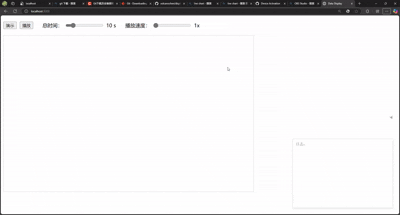

# 实时数据可视化控件



## 环境要求
### 开发环境
1. **Node.js** (推荐 v16+)
   ```bash
   # Windows 安装
   https://nodejs.org/zh-cn/download/
   
   # 验证安装
   node -v
   npm -v
   ```

基于HTML5 Canvas开发的实时数据显示组件，支持动态数据更新和交互控制。

## 功能特性
- 📊 实时数据曲线绘制（数据点动态连接）
- ⚡ 自动数据加载策略（数据量达80%时预加载）
- ⏯️ 播放/暂停控制
- 🎚️ 动态调节数据滚动播放速度 
- ⏲️ 可设置坐标轴总时间范围 
- 📝 日志实时显示


## 快速开始
```html
<!-- 基础HTML结构 -->
<canvas id="displayCanvas" width="800" height="500"></canvas>

<!-- 初始化控件 -->
<script>
const display = new DataDisplay('displayCanvas');
display.registerDataFunction(() => {
    // 返回数据数组和时间间隔
    return [newData, interval]; 
});
</script>